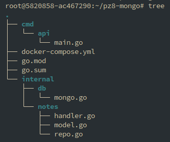
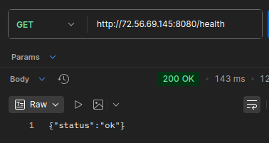
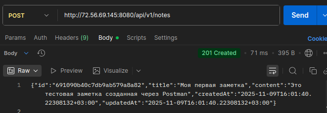
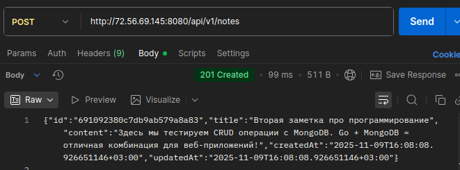
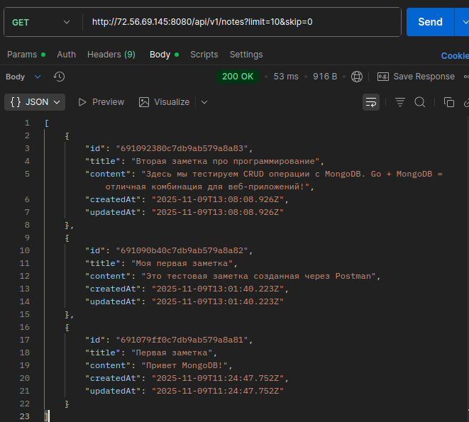
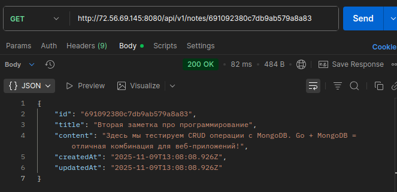
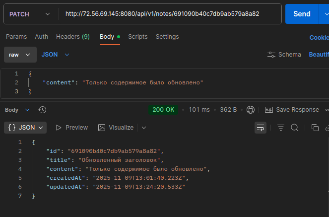
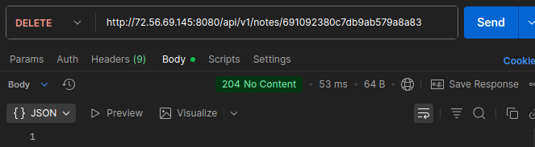
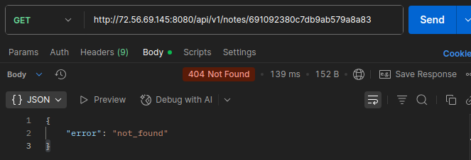

# Практическое задание № 8

# Работа с MongoDB: подключение, создание коллекции, CRUD-операции

Студент группы *ЭФМО-02-25 Пягай Даниил Игоревич*

# Описание

**Цели:**

    • Понять базовые принципы документной БД MongoDB (документ, коллекция, BSON, _id:ObjectID).
    • Научиться подключаться к MongoDB из Go с использованием официального драйвера.
    • Создать коллекцию, индексы и реализовать CRUD для одной сущности (например, notes).
    • Отработать фильтрацию, пагинацию, обновления (в т.ч. частичные), удаление и обработку ошибок.


## Инициализация проекта

```bash
mkdir pz7-redis
cd pz7-redis
go mod init example.com/pz7-redis
go get github.com/redis/go-redis/v9
```

## Создаём структуру файлов



# Запускаем сервер и проверяем

## Запрос /Health


## Создаём 2 заметки



## Получаем список


## Получаем по id


## Частичное обновление


## Удаление


## Проверка по id после удаления

